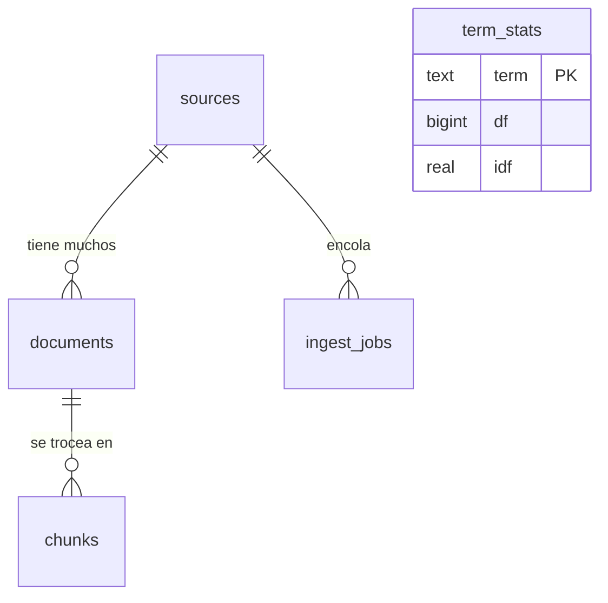

# Modelo de Datos — Base de Conocimiento

## Visión general

Postgres 18 + pgvector. Seis tablas en la migración inicial (`V1__esquema.sql`):
`sources` (una fila por fuente configurada: documentos locales, repos Git, canal de Teams, Azure
DevOps), `documents` (la unidad que el usuario reconoce: un archivo, un hilo, un work item),
`chunks` (**la tabla única de embeddings** — documentos, código, hilos y work items comparten
columna de embedding, columna FTS e índices), `term_stats` (frecuencia documental para la señal de
supresión por IDF), `ingest_jobs` (la cola de ingesta, vive en Postgres vía `SELECT ... FOR UPDATE
SKIP LOCKED`, sin Redis) y `query_log` (auditoría de cada consulta: plan, herramientas corridas,
candidatos, respuesta y citas).
Las migraciones posteriores suman `docling_tareas_en_curso` (V2), `vault_archivos` (V3),
`streams_en_curso` (V4) y `query_feedback` (V5).

## Herramienta de migraciones

- **Herramienta:** Flyway (`flyway-core` + `flyway-database-postgresql`; el autoconfig lo trae el
  módulo aparte `spring-boot-flyway` — sin él la app arranca contra una base vacía sin protestar).
- **Ubicación:** `src/main/resources/db/migration/` (`V1__esquema.sql` … `V6__streams_en_curso_query_log_id.sql`).
- **Flujo:** corre al arrancar la app (autoconfig de Spring Boot), no es un paso explícito de CI —
  no hay CI todavía (ver [infraestructura](infrastructure.md)).

## Diagrama entidad-relación

`term_stats` y `query_log` no tienen relación por FK con el resto — son tablas de apoyo (estadística
agregada y auditoría), no participan del grafo documento → chunk.

## Tablas

### Core

| Tabla | Propósito | Relaciones clave |
|---|---|---|
| `sources` | Una fila por fuente configurada, con su propia cadencia de refresco (`refresh_seconds`) | Raíz de `documents` e `ingest_jobs` |
| `documents` | La unidad reconocible: archivo, hilo o work item; `content_hash` evita re-embeber si no cambió | `source_id` → `sources`; raíz de `chunks` |
| `chunks` | **Tabla única de embeddings** — `embedding VECTOR(1024)` (bge-m3), `fts` generado (weighted, español), `distilled` JSONB con lo que el LLM destiló | `document_id` → `documents`, `source_id` → `sources` |
| `ingest_jobs` | Cola de ingesta con reintentos (`attempts`, `last_error`), tomada con `SKIP LOCKED` | `source_id` → `sources` |

### Referencia / lookup

| Tabla | Propósito |
|---|---|
| `term_stats` | IDF por término, recalculado por lote; alimenta la señal de supresión y el gate de bursting (IDF ≥ 4.0) en ingesta |
| `query_log` | Auditoría de cada consulta: plan, herramientas ejecutadas, candidatos, respuesta, citas, latencia |
| `query_feedback` | La otra mitad de esa auditoría: si la respuesta sirvió o no, con comentario opcional. Append-only, varias filas por `query_log_id` — sin login de persona en el MVP no hay identidad real contra la cual deduplicar, ver `V5__query_feedback.sql` |
| `streams_en_curso` | Estado de la última pregunta en curso por conversación (upsert, no bitácora) — permite retomar una respuesta en streaming tras un F5, ver comentario de `V4__streams_en_curso.sql`. Desde `V6`, guarda también `query_log_id` para que los botones de feedback sobrevivan a una reconexión |

## Índices relevantes

- `query_feedback_query_log_id_idx` — para `GET /api/admin/feedback` y para saber si una respuesta
  ya tiene feedback

## Seguridad a nivel de fila / control de acceso

Filtrado por `project_id` (presente en `sources`, `documents`, `chunks`, `query_log`) — el
`Planificador` acota el corpus por `ProyectoId` **antes** de elegir herramientas. No hay RLS de
Postgres activado; el filtro vive en la capa de aplicación (SQL a mano sobre `JdbcClient`, no un
guard de framework). `documents.acl` (JSONB) existe como control de acceso por fuente, pendiente de
implementación completa — ver [ADR-0007](adrs/0007-acl-por-fuente-pendiente.md).

## Docs relacionados

- [Arquitectura](./architecture.md)
- [Decisiones](./adrs/)
