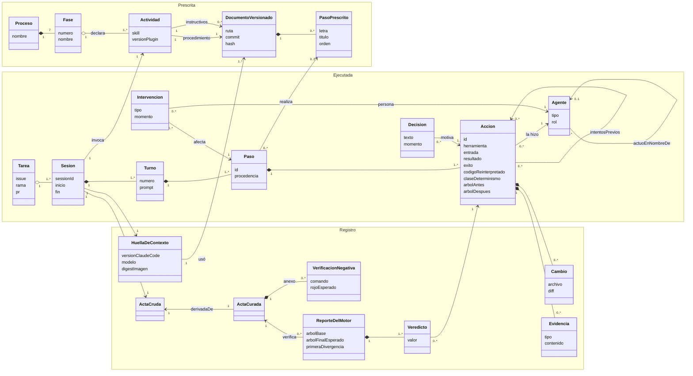

# Modelo conceptual del registro de la IA

Este modelo define qué guarda el registro de la IA (el acta) y cómo se relacionan sus partes. Sale
de las preguntas de competencia aceptadas: cada elemento existe porque alguna pregunta lo necesita,
y la matriz de la sección 7 dice cuál. Usa los tres ejes de
[jerarquia-proceso-actividad-tarea.md](jerarquia-proceso-actividad-tarea.md): descomposición del
trabajo, tiempo y documentación.

Su regla de fondo separa dos capas que no se mezclan:

- **Capa prescrita:** lo que el método dice que se haga. Son el procedimiento, el instructivo y sus
  pasos, versionados en git. En SPEM es el *Method Content*; en PROV-O, un `prov:Plan`.
- **Capa ejecutada:** lo que pasó en una sesión. Son los turnos, los pasos, las acciones, las
  decisiones y las intervenciones. En SPEM es el *Process*; en PROV-O, `prov:Activity`.

Una acción ejecutada se enlaza con un paso prescrito mediante una relación explícita que declara
su procedencia. Nunca se copia el paso prescrito dentro del acta como si fuera un hecho observado.

## 1. Diagrama

## 2. Capa prescrita

| Elemento | Qué es | Dónde vive |
|---|---|---|
| **Proceso** | El ciclo de desarrollo del método. Hay uno solo, así que va como dato constante del acta | Playbook |
| **Fase** | Una de las 7 fases del playbook (0 a 6) | `playbook-sdlc-ia/` |
| **Actividad** | Una skill de `sdlc-ia` con la versión del plugin. La fase la declara la skill; no se infiere | `instrumentacion-java-ia/` |
| **Documento versionado** | El `SKILL.md` (procedimiento) o un archivo de `references/` (instructivo), identificado por **commit, ruta y hash** | git |
| **Paso prescrito** | Un paso con letra y orden dentro de un instructivo | `references/*.md` |

El hash prueba que el documento cambió; el commit y la ruta permiten abrir la versión exacta
(PC-14).

## 3. Capa ejecutada

| Elemento | Qué es | Origen del dato |
|---|---|---|
| **Tarea** | El issue o la PR: lo que alguien puede dar por terminado | Rama y trailer del commit |
| **Sesión** | Una corrida de Claude Code. Produce un acta | Transcript principal |
| **Turno** | Un prompt del usuario y todo lo que disparó | Transcript |
| **Paso** | Un grupo de acciones dentro de un turno, enlazado o no a un paso prescrito | Marcador de la skill, o el turno completo |
| **Acción** | Una llamada a una herramienta, del orquestador, de un subagente o derivada de un hook | Transcripts y hooks |
| **Decisión** | El texto que el asistente escribió antes de una o más acciones | Transcript |
| **Intervención** | Lo que hizo una persona durante la sesión | Transcript; a verificar los hooks de permisos |
| **Agente** | Quién actuó, con su tipo y su rol | Transcript y hooks |

### Valores cerrados

| Campo | Valores |
|---|---|
| `Paso.procedencia` | `marcado` (la skill emitió el marcador) o `ausente`. **Sin inferencias en la primera versión** (PC-04): una heurística metería no determinismo en el registro |
| `Accion.exito` | `true`, `false` o `null`: sin resultado, o con un código de salida distinto de 0 que Claude Code leyó como benigno, como el 1 de un `| grep`, guardado en `codigoReinterpretado` (#219). No se infiere de la salida |
| `Accion.claseDeterminismo` | `pura`, `local`, `externa_lectura`, `efecto_externo` |
| `Agente.tipo` | `persona`, `automatismo`, `ia` |
| `Agente.rol` | `orquestador`, `subagente:<tipo>`, `hook:<nombre>`, `usuario` |
| `Intervencion.tipo` | `permiso_aprobado`, `permiso_rechazado`, `interrupcion`, `comando_usuario`, `correccion` |
| `Veredicto.valor` | `igual`, `equivalente`, `diverge`, `no_verificable` |

## 4. Cardinalidades e invariantes

Son las reglas que el compilador y la curación hacen cumplir. Si se rompe una, el acta no se emite.

1. **Una acción pertenece a un solo paso; un paso, a un solo turno; un turno, a una sola sesión.**
2. **Una sesión pertenece a una sola tarea.** Si una sesión toca dos tareas, el compilador la parte
   en dos actas por rama o por issue citado. Una tarea reúne una o más sesiones (PC-02).
3. **Las acciones de un subagente pertenecen al paso de la llamada `Agent` que lo lanzó.** El
   subagente actúa en nombre del orquestador y lleva la marca `integrado` o `descartado`, según si
   sus efectos llegan al árbol final (PC-11).
4. **Una acción en segundo plano pertenece al paso que la lanzó**, aunque su resultado llegue en
   otro turno.
5. **Sin marcador de la skill, el paso es el turno completo** y su procedencia es `ausente`. Cuando
   la skill marca sus pasos, un turno se divide en varios pasos: cada paso marcado dice su skill,
   su paso prescrito y su fase, y lo que el turno hizo antes del primer marcador es el único paso
   `ausente`, el primero del turno. El protocolo está en
   [`protocolo-de-marcadores-de-paso.md`](protocolo-de-marcadores-de-paso.md).
6. **En el acta curada, toda acción tiene `exito = true`** y todo paso tiene al menos una acción. En
   la cruda puede haber pasos sin acciones (turnos de solo texto) y acciones fallidas.
7. **Los intentos previos de una acción curada apuntan a acciones fallidas de la cruda** con la
   misma herramienta y el mismo archivo o comando, entre el éxito anterior y ella (PC-08).
8. **El acta curada se deriva de la cruda con una función determinista.** No se edita a mano.
9. **Una acción con `claseDeterminismo = efecto_externo` siempre tiene el veredicto
   `no_verificable`.**

## 5. Registro y verificación

| Elemento | Contenido | Pregunta |
|---|---|---|
| **Acta cruda** | Todo lo que pasó, incluidos los fallos. No se edita ni se borra | PC-08 |
| **Acta curada** | Solo acciones exitosas y residuos. Es lo que re-ejecuta el motor | PC-12 |
| **Anexo de verificaciones negativas** | Cada rojo esperado, con el comando y el sensor o la prueba que demuestra. No se re-ejecuta | PC-16 |
| **Huella de contexto** | Commit, ruta y hash de cada documento usado; versiones del plugin y de Claude Code; modelo; digest de la imagen | PC-14 |
| **Cambio** | El diff de un archivo dentro de una acción. Al cerrar el acta, el compilador arma el índice inverso de archivo a acciones | PC-03 |
| **Evidencia** | Una captura o un `trace` de Playwright, adjuntos a la acción que los produjo | — |
| **Reporte del motor** | Árbol base, árbol final esperado, un veredicto por acción y la primera divergencia | PC-12, PC-13 |

El visor nunca dice «ejecutado» de una acción que solo reprodujo su fixture. Sin reporte del
motor, el estado es «reproducción del registro, sin verificar» (PC-13).

## 6. Correspondencia con estándares

El acta usa sus propios nombres, pero se tiene que poder exportar sin pérdida a los dos estándares
(PC-15).

### W3C PROV-O

| Elemento del modelo | PROV-O |
|---|---|
| Acta (cruda o curada) | `prov:Bundle`: la procedencia de la procedencia |
| Sesión, Turno, Paso, Acción | `prov:Activity`, anidadas con `prov:wasInformedBy` |
| Paso prescrito, procedimiento, instructivo | `prov:Plan`, enlazado con `prov:qualifiedAssociation` y `prov:hadPlan` |
| Agente de tipo `persona` | `prov:Person` |
| Agente de tipo `ia` o `automatismo` | `prov:SoftwareAgent` |
| Acción → agente | `prov:wasAssociatedWith` |
| Subagente → orquestador | `prov:actedOnBehalfOf` |
| Archivo antes y después de una acción | `prov:Entity` con `prov:used` y `prov:wasGeneratedBy` |
| Acta curada → cruda | `prov:wasDerivedFrom` |
| Decisión → acción | `prov:wasInfluencedBy` |
| Inicio y fin | `prov:startedAtTime`, `prov:endedAtTime` |

### OCEL 2.0

| Elemento del modelo | OCEL 2.0 |
|---|---|
| Acción | Evento; su tipo es la herramienta (`Edit`, `Bash`…) |
| Tarea, sesión, paso, paso prescrito, archivo, agente | Objetos, uno por tipo |
| Acción → paso, archivo, agente | Relación evento-objeto con calificador (`paso`, `modifica`, `ejecutor`) |
| Paso → paso prescrito, subagente → orquestador | Relación objeto-objeto (`realiza`, `en_nombre_de`) |
| Éxito, clase de determinismo, veredicto | Atributos del evento |

Las preguntas de PC-05, PC-06 y PC-15 se responden con minería de procesos sobre la exportación
OCEL. El análisis entre actas se difiere hasta tener unas 20; la exportación entra desde la primera
versión.

## 7. Matriz de preguntas de competencia

| Pregunta | Prioridad | Elementos que la responden |
|---|---|---|
| PC-01 · ¿A qué paso, turno, tarea, actividad y fase pertenece cada acción? | Alta | Acción, Paso, Turno, Sesión, Tarea, Actividad, Fase · invariantes 1 y 2 |
| PC-02 · ¿Qué sesiones contribuyeron a una tarea y en qué fase? | Media | Tarea, Sesión, Actividad → Fase |
| PC-03 · ¿Qué archivos cambió una tarea y qué acción los cambió? | Alta | Cambio, índice inverso, Agente |
| PC-04 · ¿Qué paso del instructivo realiza cada acción, y ese vínculo lo marcó la skill o falta? | Alta | Paso → PasoPrescrito, `procedencia` |
| PC-05 · ¿Qué pasos se omitieron, repitieron o desordenaron? | Media | Paso → PasoPrescrito con `orden` · exportación OCEL |
| PC-06 · ¿Qué acciones no corresponden a ningún paso? | Baja | Paso con `procedencia = ausente` |
| PC-07 · ¿Por qué el agente eligió esta acción? | Alta | Decisión → Acción |
| PC-08 · ¿Qué intentos fallidos hubo antes de cada éxito? | Alta | Acción → intentos previos en el acta cruda · invariante 7 |
| PC-09 · ¿Qué hizo una IA, un automatismo o una persona? | Alta | Agente con `tipo` y `rol` |
| PC-10 · ¿Dónde intervino una persona? | Media | Intervención → Paso |
| PC-11 · ¿Qué hizo cada subagente y llegó al árbol final? | Alta | Agente `actuoEnNombreDe`, marca `integrado` · invariante 3 |
| PC-12 · ¿El acta curada llega al árbol del commit? | Alta | Reporte del motor, Veredicto |
| PC-13 · ¿Qué acciones solo se reproducen desde el fixture? | Alta | `claseDeterminismo`, Veredicto · invariante 9 |
| PC-14 · ¿Con qué versiones se produjo el acta? | Alta | Huella de contexto → Documento versionado |
| PC-15 · ¿Qué pasos concentran fallos e intervenciones entre actas? | Media | Exportación OCEL 2.0 y PROV-O |
| PC-16 · ¿Qué verificaciones negativas respaldan cada sensor? | Media | Anexo de verificaciones negativas |
| PC-17 · ¿Alcanza el instructivo para replicar el resultado? | Baja | **Fuera del modelo** |

**PC-17** se mide fuera del arnés: la re-ejecución no usa el modelo, y replicar exige que lo use.
Si algún día se mide, va como experimento en `EXPERIMENTS.md`, comparando por equivalencia (pruebas
y sensores en verde) y no por hash.

## 8. Pendientes antes de implementar

- **Eventos de permisos (PC-10).** Hay que verificar qué eventos de hook relacionados con permisos
  ofrece la versión de Claude Code en uso. Si no hay ninguno, la intervención sale solo del
  transcript, y un permiso aprobado puede no dejar rastro.
- **Marcadores de paso (PC-04 y PC-05).** Desde #222 el protocolo existe y `debt-triage` lo
  emite. Las otras ocho skills todavía no: sus pasos quedan con `procedencia = ausente` y la
  conformidad responde «sin datos». Cada skill que se suma toca su `SKILL.md`, el visor y el
  playbook en el mismo PR.
- **Redacción de secretos en las decisiones (PC-07).** El texto del asistente puede citar
  contenido leído de archivos. Pasa por el mismo filtro que el resto del acta antes de escribirse.
