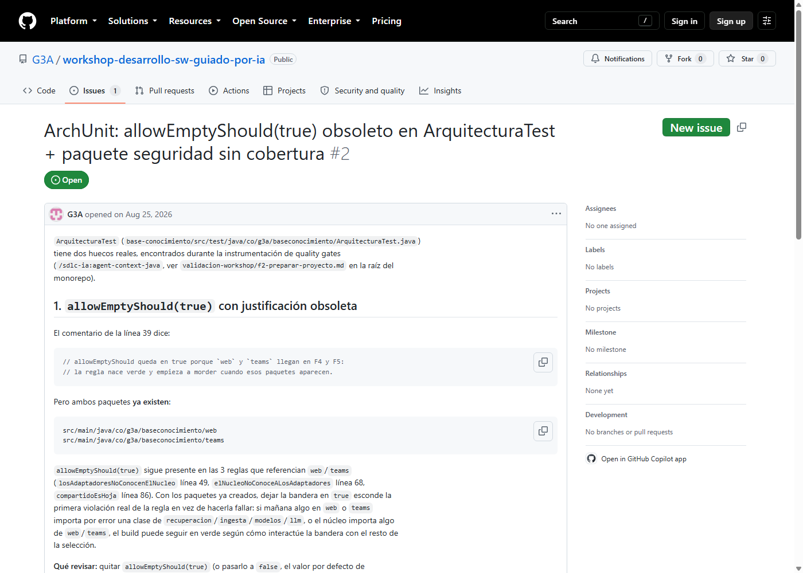
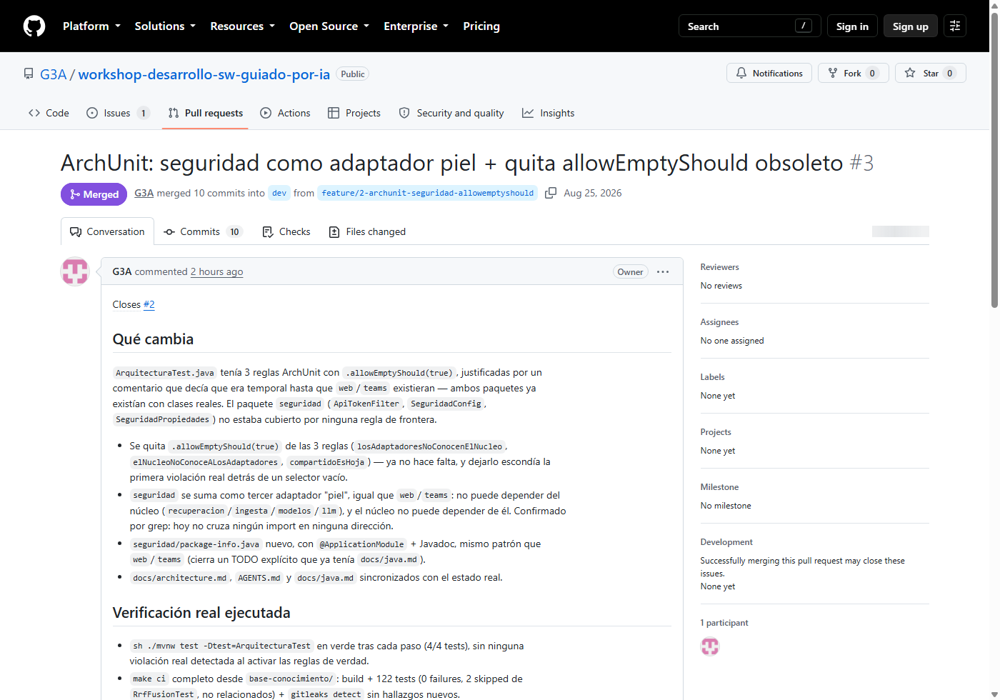
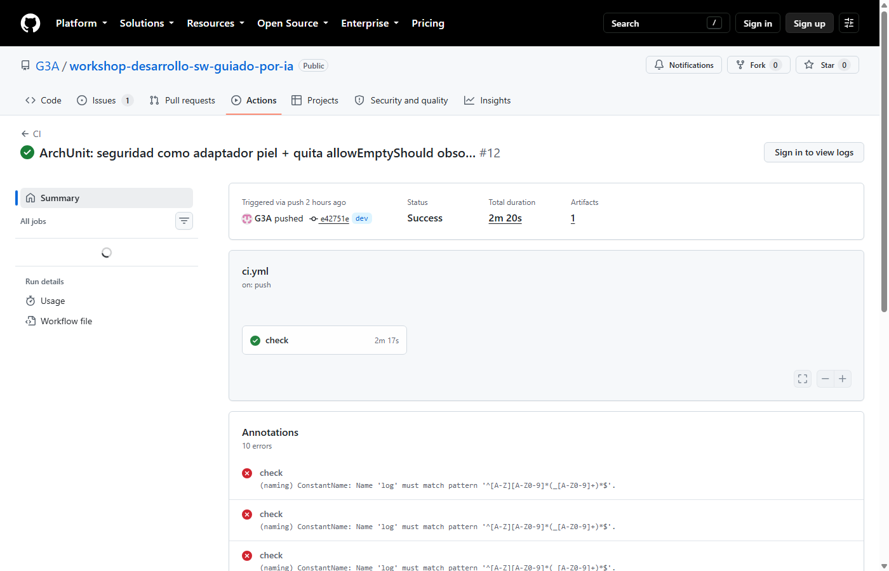
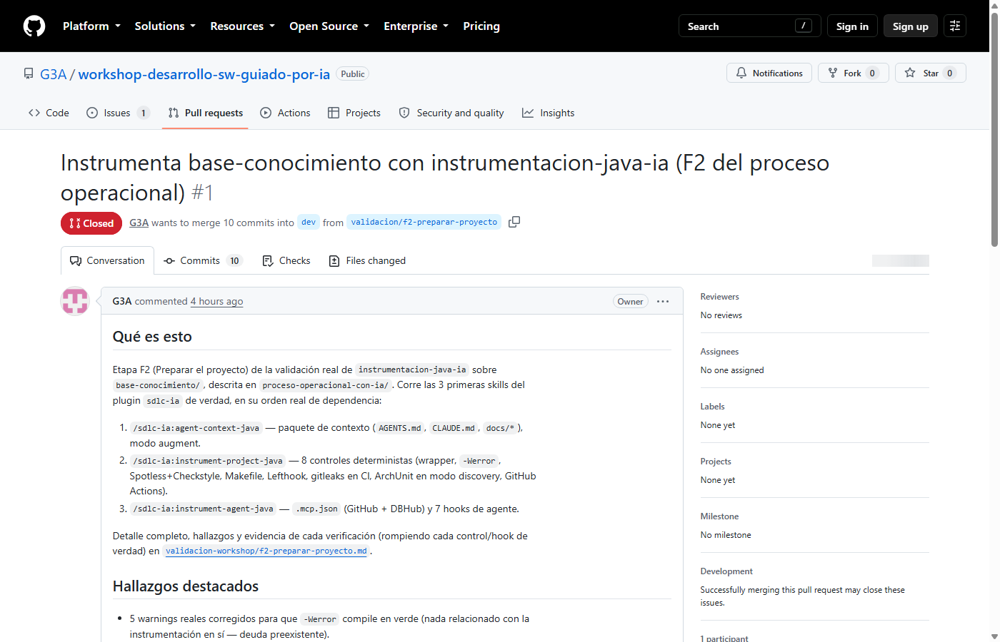

# Validación real de `instrumentacion-java-ia`

### 4 skills del plugin `sdlc-ia`, corridas de verdad sobre `base-conocimiento/`

Sin simular nada: comandos reales, PRs reales, CI real.

Note:
Bienvenida. Esto no es una demo con datos de ejemplo — cada comando, cada captura y cada link de
este deck se ejecutó de verdad sobre este mismo monorepo, en la rama `dev` real de
`G3A/workshop-desarrollo-sw-guiado-por-ia`. La idea es mostrar el ciclo completo issue → PR → CI →
merge tal como lo vive un equipo, con las fricciones reales que aparecieron en el camino, no solo
el camino feliz.

---

## El plan

8 etapas, calcadas de `proceso-operacional-con-ia/`, cada una en su propia rama:

```
dev
 └─ f0 → f1 → f2
     └─ f3 → feature/2-... → f6 → f7
```

**Regla dura de toda la validación: nunca se toca `main`.**

Note:
El BPMN didáctico del curso ordena estas etapas de forma simplificada. Acá se respeta el orden de
dependencia *real* entre las 4 skills, documentado en sus propios `SKILL.md`, no el orden narrativo
del diagrama — eso ya es el primer hallazgo de esta corrida.

---

## F0 — Fundamentos

¿Este repo ya tiene la disciplina básica de colaboración?

```
$ git log --oneline -10
dde0f47 Reestructura el repo en monorepo: base-conocimiento, ...
11c6296 Ignora artefactos de node_modules, pesos de modelos de IA...
0dea23f Agrega sintesis estructurada a ocho candidatos descartados...
f62c73f Agrega el visor modal de citas del vault...
```

**Conclusión: sí.** Mensajes que explican el *por qué*, no una lista de archivos. F0 no necesita
ninguna intervención.

Note:
Este paso existe para no dar por sentado lo obvio. Un agente de IA que va a operar sobre un repo
necesita que la historia de commits sea legible — si no lo es, instrumentar CI y hooks encima no
alcanza.

---

## F1 — Preparar la máquina

Instalación real de las herramientas, no supuesta:

```
$ winget install --id GitHub.cli -e ...
Instalado correctamente

$ gh auth status
✓ Logged in to github.com account G3A (keyring)

$ claude plugin marketplace add "...\instrumentacion-java-ia"
✔ Successfully added marketplace: sdlc-ia

$ claude plugin install sdlc-ia
✔ Successfully installed plugin: sdlc-ia@sdlc-ia
```

4 skills quedan disponibles: `agent-context-java`, `instrument-project-java`,
`instrument-agent-java`, `github-plan-build`.

---

## F2 — Preparar el proyecto

3 skills, en el orden de **dependencia real** (no el del BPMN didáctico):

1. `/sdlc-ia:agent-context-java` — modo *augment*, no arranca de cero
2. `/sdlc-ia:instrument-project-java` — 8 controles de calidad
3. `/sdlc-ia:instrument-agent-java` — MCP + 7 hooks del agente

Note:
`agent-context-java` corrió en modo augment: ya existían `docs/architecture.md` y 11 ADRs, así que
completó huecos en vez de pisar nada. Ahí mismo apareció el hallazgo que va a dar forma a F3-F7.

---

### El hallazgo que arrancó todo

`agent-context-java` detecta, documenta, **no corrige** — así está diseñado:

- `ArquitecturaTest.java`: 3 reglas ArchUnit con `allowEmptyShould(true)`, justificadas por un
  comentario que dice "hasta que existan `web`/`teams`" — **ya existen**.
- El paquete `seguridad` no está cubierto por ninguna regla de frontera.

Esto se convierte en el issue real de F3.

---

### 8 controles instalados, verificados rompiéndolos de verdad

| Control | Estado |
|---|---|
| `-Werror` | Verde tras **5 fixes reales** preexistentes |
| Spotless + Checkstyle | Spotless verde (ratchet); Checkstyle en modo reporte |
| `lefthook.yml` | Instalado, verificado rompiendo cada hook |
| `gitleaks` | Primer run real en CI: 3 hallazgos, los 3 falsos positivos confirmados |
| CI (GitHub Actions) | `.github/workflows/ci.yml`, versiones reales resueltas con `gh` |

---

### Cada control, verificado rompiéndolo de verdad

```
$ make check
[INFO] Tests run: 122, Failures: 0, Errors: 0, Skipped: 2
[INFO] BUILD SUCCESS
OK -- the repo is green
```

Note:
Cada control se probó fallando antes de darlo por bueno — un `List` raw type disparando
`-Xlint:rawtypes` y bloqueando el compile de verdad, un `git reset --hard` bloqueado por el hook de
comandos peligrosos, etc. El detalle completo de los 5 fixes y los 2 hallazgos de topología del
monorepo (`.github/workflows/` y `lefthook.yml` van en la raíz, no en `base-conocimiento/`) está en
`validacion-workshop/f2-preparar-proyecto.md`.

---

## F3 — Planificar

Issue real, no de ejemplo:



Note:
El issue cita las líneas exactas de `ArquitecturaTest.java` y el criterio de qué revisar — nace de
leer el código, no de inventar un caso de estudio.

---

### `/sdlc-ia:github-plan-build 2` — Step A: preguntar antes de programar

Dos preguntas reales, ninguna con respuesta obvia en el issue:

1. **Frontera de `seguridad`** — ¿"adaptador piel" como `web`/`teams` (solo toca la fachada, no
   conoce el núcleo)? → **Sí**, confirmado por evidencia de código (cero imports cruzados).
2. **Profundidad de verificación** — ¿alcanza con ArchUnit? → **Sí**, `ApiTokenFilter` ya tiene su
   propio test de comportamiento.

Note:
"Adaptador piel" es terminología real del propio proyecto, no una metáfora que invento yo para
esta charla: aparece literal en `ArquitecturaTest.java` ("Los adaptadores son piel: no conocen el
retrieval, solo la fachada") y en `AGENTS.md`. La idea: el núcleo (recuperación, ingesta, modelos,
LLM) no sabe que existen `web`, `teams` o `seguridad` — solo pueden tocarlo a través de una única
puerta, la fachada `Consultar`. Por eso son "reemplazables" sin tocar el núcleo, y por eso ArchUnit
lo hace cumplir de verdad en cada build, no solo en un documento.

---

### Step D — Revisión adversarial, 3 lentes en paralelo

El plan inicial tocaba **1 archivo**. Después de la revisión, **5**:

| Lente | Hallazgo real |
|---|---|
| Convenciones | `docs/architecture.md`/`AGENTS.md` quedarían desactualizados; el gate correcto es `make ci`, no `make check` |
| Corrección | Confirmado por grep: ninguna clase viola las reglas nuevas; `modulosValidos` no es redundante con ellas |
| Alcance | Las 3 lentes coincidieron: falta `seguridad/package-info.java` — decisión de arquitectura real, no un detalle |

Segunda ronda de preguntas → **se cierra también en este PR**.

Note:
Las 3 lentes corrieron como agentes `general-purpose` independientes, cada una con instrucciones
de *refutar*, no de confirmar. Que las 3 coincidieran en el mismo hallazgo sin haberse visto entre
sí es la señal más fuerte de todo el ejercicio de que el hallazgo era real.

---

### Step E — Checkpoint real

5 archivos tocados → cruza el umbral de "más de ~3" que el propio skill define.

`EnterPlanMode` real → plan completo presentado → `ExitPlanMode` real →
**aprobación real de la persona usuaria**, no simulada.

---

## F4/F5 — Implementar, verificar, PR, CI

Aprobado el plan, el flujo siguió solo en la misma sesión (Steps F→J):

```
$ sh ./mvnw test -Dtest=ArquitecturaTest
Tests run: 4, Failures: 0, Errors: 0, Skipped: 0
BUILD SUCCESS

$ make ci
Tests run: 122, Failures: 0, Errors: 0, Skipped: 2
gitleaks: no leaks found
```

`/code-review` a nivel medio sobre el diff: sin hallazgos.

---

### PR real, verde, sin comentarios pendientes



---

### CI real en verde



Note:
Los 10 "errores" en rojo de las anotaciones no son un fallo — son avisos de Checkstyle
preexistentes (`ConstantName` sobre el logger `log`, 35 violaciones de brownfield ya documentadas
en F2) que reportan pero no bloquean (`failOnViolation=false`). El job `check` sigue en verde.

---

## F6 — Merge + CD

Merge real contra `dev` (nunca `main`), confirmado con el usuario:

```
$ gh pr merge 3 --squash --delete-branch
```

Sin CD que mostrar — este repo no tiene job de despliegue todavía. Documentado como "no aplica
hoy", no como paso pendiente.

---

### El hallazgo que nadie planeó

La rama de F3 había nacido de la punta de `f2` (no de `dev`) porque `dev` todavía no tenía
mergeada la instrumentación de F2.

**Consecuencia real:** mergear el PR de F3 absorbió *todo* el contenido de F2 de un solo golpe —
el PR original de F2 quedó redundante.



Note:
Esto es exactamente el tipo de fricción de segundo orden que solo aparece al ejecutar de verdad:
apilar una rama de trabajo sobre un PR sin mergear es un patrón real y común, pero tiene una
consecuencia sobre el PR original que ninguna de las 4 skills decide por vos. Se cerró `#1` con un
comentario explicando por qué, en vez de mergearlo vacío.

---

## F7 — Retrospectiva

**Qué funcionó:**
- La revisión adversarial cazó un hallazgo real que el plan inicial no tenía
- Los checkpoints preguntaron exactamente lo que hacía falta preguntar, nada más
- El umbral de "más de 3 archivos → plan mode" se disparó solo, correctamente

---

## F7 — Retrospectiva (cont.)

**Qué ajustaría en `instrumentacion-java-ia`:**
1. `allowEmptyShould(true)` no caduca solo — ningún mecanismo avisa cuando la condición ya se cumplió
2. `github-plan-build` no detecta PRs hermanos en curso al elegir la rama base
3. `/code-review` en Step G no se acota a ramas de vida larga
4. Fricción repetida de `PATH` de `winget` en Windows (`gh`, `gitleaks`)

---

## Cierre

- **8 etapas**, todas con evidencia real: commits, PRs, CI, capturas
- **2 desviaciones deliberadas**, documentadas en el momento, no descubiertas después
- **1 hallazgo de flujo no anticipado** (F6), que solo la ejecución real podía sacar a la luz

Todo el detalle, etapa por etapa, en `validacion-workshop/` — raíz del monorepo.

Note:
Cierre de la sesión. El objetivo de esta validación no era que todo saliera perfecto a la primera
— era mostrar qué pasa cuando estas 4 skills se corren de verdad, con las fricciones reales que
trae un monorepo, un repo brownfield, y decisiones que tienen consecuencias que nadie ve venir
hasta que se ejecutan. Preguntas.
